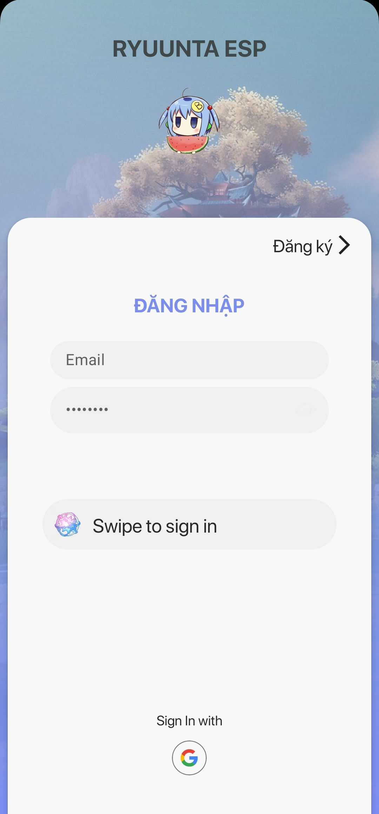
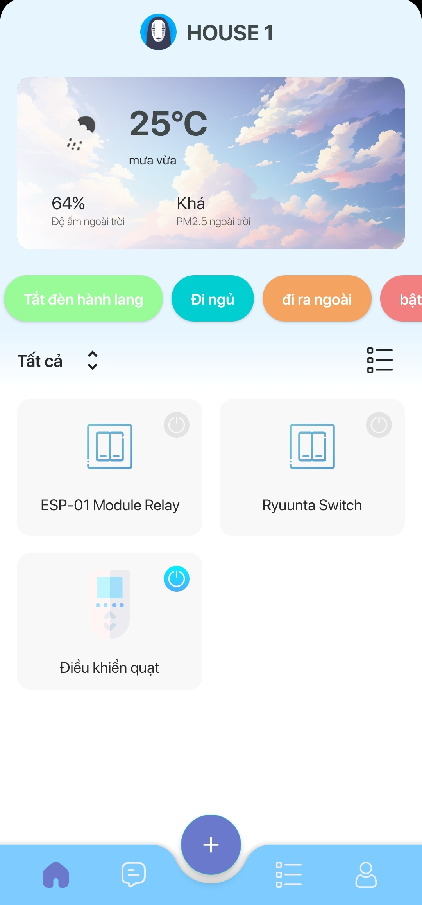
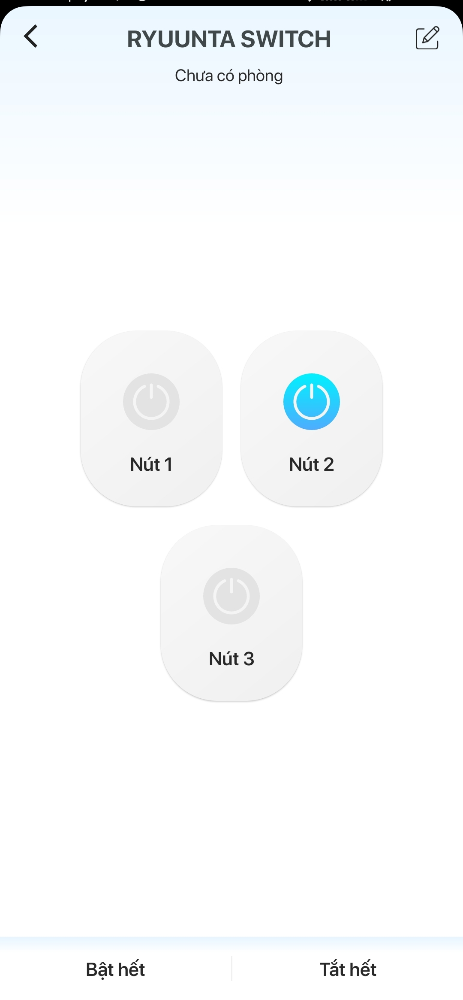

# Ryuunta ESP - DIY Personal IoT Project

Ryuunta ESP is an IoT (Internet of Things) project designed to meet personal needs. This project uses Firebase Realtime to connect and control ESP modules through the Internet, providing convenience and efficiency in managing smart devices in daily life.

## Features
- **Monitor outdoor and indoor weather**: Track the temperature both outside and inside to make informed decisions on device control.
- **Remote device control**: Control your electronic devices from anywhere via the Internet.
- **Monitor device status**: Keep track of the operational status of your smart devices remotely.
- **Anime-themed user interface**: A user-friendly (and beautiful 😌) interface for managing and controlling devices.

## Illustration

    
     

## Notes
#### This personal project uses publicly available images and icons that may be copyrighted. Please do not use them for commercial purposes.

